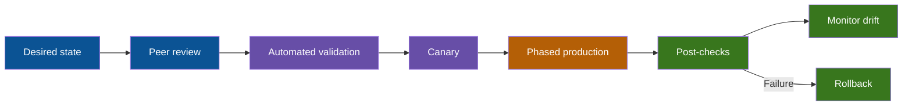

# Module 5 — AI, Network Operations and Management

> **Exam weight:** 10%  
> **Core skill:** Use automation and AI as controlled assistants while preserving evidence, security and human accountability.

## Agentic AI in Network Operations

### Generative and Agentic Systems

A generative system produces content from a prompt. An agentic system can pursue a goal through a loop such as:


Possible network uses:

- Summarising logs and incidents.
- Proposing likely causes from command output.
- Comparing intended and observed configuration.
- Generating a candidate change or test plan.
- Querying inventory and telemetry through approved tools.
- Checking compliance and documentation.

### Risks

- Hallucinated commands or unsupported features.
- Recommendations based on stale/incomplete state.
- Secret or customer-data exposure.
- Excessive permissions and automation blast radius.
- Confirmation bias when the model accepts the operator's first theory.
- Changes without rollback, peer review or validation.

### Safe Operating Pattern

1. Classify and minimise supplied data.
2. Ask for hypotheses, assumptions and evidence.
3. Require read-only verification commands first.
4. Check platform/release compatibility.
5. Review proposed configuration and blast radius.
6. Test in a lab or limited canary.
7. Preserve rollback and out-of-band access.
8. Validate outcome against objective metrics.

🟥 AI output is a recommendation, not evidence. Device state, packet capture, telemetry and validated documentation remain evidence.

## Prompt Selection

A strong operational prompt contains:

- **Persona:** role the system should adopt.
- **Objective:** precise task or question.
- **Context:** topology, platform, symptoms and timing.
- **Evidence:** sanitised output and known facts.
- **Constraints:** read-only, no assumptions, platform limits.
- **Data classification:** what must not be exposed.
- **Output format:** table, ordered checks, candidate causes.
- **Validation:** require commands and expected observations.

### Weak Prompt

> Network is broken. Fix it.

This lacks scope, evidence, constraints and success criteria.

### Better Prompt

> Act as a Cisco IOS XE network troubleshooting assistant. A client in VLAN 20 cannot reach its gateway, while VLAN 30 works. Using the sanitised outputs below, rank up to three hypotheses. For each, cite the evidence, identify missing evidence and provide read-only verification commands. Do not propose configuration changes yet. Return a table. Treat all addresses and hostnames as internal-confidential and do not reproduce unrelated data.

### Evaluating Suggested Prompts

Prefer the prompt that:

1. Minimises sensitive data.
2. States the device/platform and goal.
3. Separates known facts from assumptions.
4. Requests bounded output.
5. Requires evidence and verification.
6. Prevents immediate high-risk action.

## Network-Management Approaches

| Approach | Characteristics | Strength | Limitation |
|---|---|---|---|
| Device-based | CLI/WebUI per device | Direct and simple for small scope | Inconsistent at scale |
| Cloud-based | Vendor cloud manages devices | Central access and simplified lifecycle | Internet/vendor dependency |
| Controller-based | Controller supplies policy/intent | Central consistency and visibility | Controller design and integration |
| Automation-based | Scripts/tools apply repeated tasks | Speed and repeatability | Requires engineering and controls |
| Infrastructure as code | Desired state stored as versioned code | Review, audit and reproducibility | Tooling/state discipline required |

These approaches can coexist. An organisation may use a controller, automate its API and store policy in version control.

### Configuration Lifecycle



## SNMP

SNMP components:

- **Manager/NMS:** queries and receives notifications.
- **Agent:** software on managed device.
- **MIB:** structured description of managed objects.
- **OID:** identifier for a specific object.

### Operations

- GET reads an object.
- GETNEXT/GETBULK walks objects efficiently.
- SET changes an object where allowed.
- Trap sends an unsolicited notification without acknowledgment.
- Inform sends a notification with acknowledgment.

### Versions

- SNMPv2c uses community strings and lacks modern confidentiality/authentication.
- SNMPv3 supports authentication and privacy; prefer it for secure operations.

Illustrative configuration:

```ios
snmp-server group NMS-GROUP v3 priv
snmp-server user nmsuser NMS-GROUP v3 auth sha <auth-secret> priv aes 128 <priv-secret>
snmp-server host 10.99.0.50 version 3 priv nmsuser
snmp-server enable traps
```

```ios
show snmp
show snmp user
show snmp group
```

Operational uses include interface state, counters, utilisation, CPU, memory, environmental sensors and device notifications.

🟥 Polling shows sampled state; a short microburst can occur between polls. High-resolution telemetry or packet analysis may be required.

## Ansible

Ansible is agentless for common network use. A control node connects to devices, reads inventory and runs tasks/modules in playbooks.

### Concepts

- **Inventory:** managed devices and groups.
- **Play:** target hosts plus ordered tasks.
- **Module:** unit of work.
- **Variables:** reusable data.
- **Facts:** observed device information.
- **Handler:** action triggered by a change.
- **Idempotency:** repeated runs converge without unnecessary change.

### Example Inventory

```yaml
all:
  children:
    access_switches:
      hosts:
        sw1:
          ansible_host: 192.0.2.11
        sw2:
          ansible_host: 192.0.2.12
  vars:
    ansible_connection: ansible.netcommon.network_cli
    ansible_network_os: cisco.ios.ios
```

### Read-Only Command Playbook

```yaml
---
- name: Collect interface state
  hosts: access_switches
  gather_facts: false
  tasks:
    - name: Run show commands
      cisco.ios.ios_command:
        commands:
          - show interfaces status
          - show etherchannel summary
          - show spanning-tree root
      register: output

    - name: Display results
      ansible.builtin.debug:
        var: output.stdout_lines
```

### Configuration Example

```yaml
---
- name: Enforce NTP servers
  hosts: all
  gather_facts: false
  tasks:
    - name: Configure approved NTP servers
      cisco.ios.ios_config:
        lines:
          - ntp server 192.0.2.20 prefer
          - ntp server 192.0.2.21
```

Use vault/encrypted secret handling rather than plaintext passwords in inventory. Validate in check mode where supported, inspect diffs, canary, then phase rollout.

## Syslog

### Severity Levels

| Level | Name | Meaning |
|---:|---|---|
| 0 | Emergency | System unusable |
| 1 | Alert | Immediate action required |
| 2 | Critical | Critical condition |
| 3 | Error | Error condition |
| 4 | Warning | Warning condition |
| 5 | Notification | Normal but significant event |
| 6 | Informational | Informational message |
| 7 | Debugging | Detailed debugging |

Lower number means greater severity. Configuring level 4 normally includes levels 0 through 4.

Typical IOS message:

```text
%LINK-3-UPDOWN: Interface GigabitEthernet1/0/10, changed state to down
```

- `LINK` is the facility.
- `3` is severity Error.
- `UPDOWN` is the mnemonic.
- Remaining text describes the event.

### Configuration

```ios
service timestamps log datetime msec localtime show-timezone
logging buffered 64000 warnings
logging host 10.99.0.60
logging trap informational
logging source-interface Loopback0
```

```ios
show logging
show clock
show ntp associations
```

Accurate time is essential for correlation. An event sequence with unsynchronised clocks can lead to incorrect causal conclusions.

### Debugging Safety

Debug output may be high volume and CPU-intensive. Use targeted debugging, time limits and console-safe logging. Disable it after use.

```ios
show debugging
undebug all
```

## Integrated Operational Scenario

An access switch reports intermittent uplink failure:

1. Syslog shows the member interface flapping.
2. SNMP graphs show rising input errors before each flap.
3. Ansible collects consistent `show interfaces` and optic readings across peers.
4. An AI assistant ranks optic contamination and fibre loss as hypotheses.
5. The engineer verifies receive power and swaps the suspect patch lead under a controlled MOP.
6. Post-checks confirm stable optical power, zero new errors and restored port-channel membership.

AI accelerated analysis; it did not replace measurements or change control.

## Low-Latency Perspective

🟪 Millisecond timestamps and clock synchronisation improve incident reconstruction. Trading environments may need PTP and nanosecond hardware timestamps beyond ordinary syslog.

🟪 Polling intervals can miss microbursts and short queue drops. Combine management-plane telemetry with NIC/switch counters and packet capture.

🟪 Automation is essential for consistent BIOS/NIC/switch configuration, but a rapid incorrect rollout is worse than a slow manual mistake. Canary and failure-domain sequencing matter.

🟪 AI prompts should include latency percentile changes, exact time windows, queue counters and path identity—not only average utilisation.

## Module Checklist

- [ ] Explain generative versus agentic AI.
- [ ] Select prompts that protect data and demand evidence.
- [ ] Compare device, cloud, controller, automation and IaC management.
- [ ] Explain SNMP manager, agent, MIB, OID, polling and notifications.
- [ ] Read an Ansible inventory/playbook and explain idempotency.
- [ ] Interpret syslog facility, severity and mnemonic.
- [ ] Design an operational workflow with review, canary, validation and rollback.

