# CCNA 200-301 v2.0 — Low-Latency Network Engineering Course

> **Target exam:** Cisco CCNA 200-301 v2.0, available from 3 February 2027  
> **Primary goal:** Pass CCNA v2.0 through understanding, configuration and troubleshooting  
> **Specialisation:** Relate every suitable topic to deterministic, low-latency and trading-network operations

## Start Here

1. Read [00_SYLLABUS.md](00_SYLLABUS.md).
2. Complete modules `01` through `05` in order.
3. Build every topology in [06_LABS.md](06_LABS.md).
4. Study the low-latency extension after the corresponding CCNA lesson.
5. Complete [08_STANDARD_QA.md](08_STANDARD_QA.md) without notes.
6. Work through [09_SCENARIO_QA.md](09_SCENARIO_QA.md) by explaining each troubleshooting decision.
7. Take both timed exams in [10_PRACTICE_EXAMS.md](10_PRACTICE_EXAMS.md).
8. Use [11_FINAL_REVISION.md](11_FINAL_REVISION.md) during the final week.

## Course Map

```mermaid
flowchart LR
    A[Infrastructure<br/>25%] --> B[Switching<br/>25%]
    B --> C[IP Routing<br/>20%]
    C --> D[Services & Security<br/>20%]
    D --> E[AI & NetOps<br/>10%]
    E --> F[Labs & Troubleshooting]
    F --> G[Practice Exams]
    G --> H[CCNA v2.0]

    classDef foundation fill:#0b5394,color:#fff,stroke:#073763;
    classDef forwarding fill:#38761d,color:#fff,stroke:#274e13;
    classDef operations fill:#674ea7,color:#fff,stroke:#351c75;
    classDef exam fill:#cc0000,color:#fff,stroke:#660000;
    class A,B foundation;
    class C forwarding;
    class D,E,F operations;
    class G,H exam;
```

## Documents

| File | Purpose |
|---|---|
| [00_SYLLABUS.md](00_SYLLABUS.md) | Blueprint mapping, sequence and study plan |
| [01_NETWORK_INFRASTRUCTURE.md](01_NETWORK_INFRASTRUCTURE.md) | Cabling, addressing, wireless, clients, DHCP and virtualisation |
| [02_SWITCHING_AND_ACCESS.md](02_SWITCHING_AND_ACCESS.md) | VLANs, trunks, EtherChannel, SVIs, discovery and Rapid PVST+ |
| [03_IP_ROUTING.md](03_IP_ROUTING.md) | Routing tables, static routing, OSPFv2/v3, HSRP and VRRP |
| [04_SERVICES_AND_SECURITY.md](04_SERVICES_AND_SECURITY.md) | AAA, secure transfer, NAT, DNS, VPNs, ACLs and Layer 2 security |
| [05_AI_AND_NETOPS.md](05_AI_AND_NETOPS.md) | Agentic AI, prompting, management models, SNMP, Ansible and syslog |
| [06_LABS.md](06_LABS.md) | Progressive Packet Tracer/CML labs and verification criteria |
| [07_COMMAND_REFERENCE.md](07_COMMAND_REFERENCE.md) | IOS/IOS XE configuration and troubleshooting commands |
| [08_STANDARD_QA.md](08_STANDARD_QA.md) | Recall and concept questions with answers |
| [09_SCENARIO_QA.md](09_SCENARIO_QA.md) | Troubleshooting cases with reasoning and solutions |
| [10_PRACTICE_EXAMS.md](10_PRACTICE_EXAMS.md) | Two original timed mock examinations |
| [11_FINAL_REVISION.md](11_FINAL_REVISION.md) | Final-week checklist, traps and rapid review |
| [12_GLOSSARY.md](12_GLOSSARY.md) | Definitions and protocol/port reference |

## Legend

- 🟦 **Exam Core:** Required for CCNA v2.0.
- 🟩 **Configure:** Practise the command until it can be entered from memory.
- 🟨 **Troubleshoot:** Interpret output and isolate the fault.
- 🟪 **Low-Latency Extension:** Valuable for HFT/ULL work; may exceed CCNA scope.
- 🟥 **Exam Trap:** Commonly confused concepts or wording.

## Source and Scope

The exam mapping follows Cisco's public [CCNA 200-301 v2.0 exam topics](https://learningcontent.cisco.com/documents/marketing/exam-topics/200-301_CCNA_v2.0_Exam_Topics_PDF.pdf). This is an independent study course, not an exam dump or an official Cisco publication. Cisco notes that its topic list is a general guide and related material may also appear.

